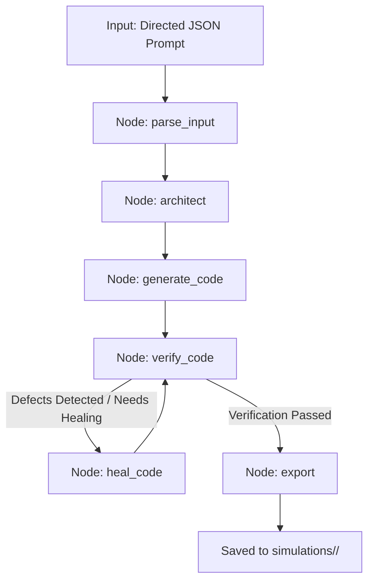
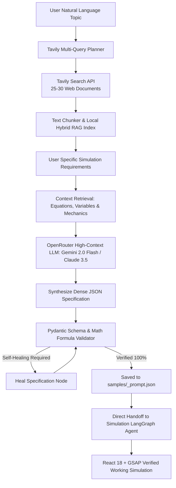

# SimulateNotes // AI Research & Interactive Science Simulations

An intelligent, dual-agent AI research and simulation platform combining **Tavily Deep RAG** with **LangGraph React + GSAP Simulation Generation** in an authentic, high-precision monochrome interface.

SimulateNotes takes scientific research questions, crawls and indexes authoritative academic literature into a localized RAG database, and dynamically generates 60 FPS interactive physics and engineering simulations rendered directly in an embedded, secured Studio sandbox.

---

## Clean Directory Organization

The project is cleanly modularized into dedicated folders:

```
project_genrate/
│
├── langgraph_agent/                      # 🧠 Standalone Reusable Agent Package
│   ├── __init__.py                       # Package exports (build_simulation_graph, run_simulation_agent)
│   ├── cli.py                            # CLI handler
│   ├── config.py                         # OpenRouter API key & model settings
│   ├── graph.py                          # LangGraph StateGraph workflow definition
│   ├── nodes.py                          # Graph node logic (parse, architect, generate, verify, heal, export)
│   ├── prompts.py                        # System prompts (Architect, Generator, Healer)
│   └── state.py                          # SimulationState TypedDict
│
├── simulations/                          # 🎨 Generated Simulation Deliverables
│   └── bernoulli/                        # Bernoulli & Venturi Flow Simulation
│       ├── BernoulliSimulation.jsx       # Complete React 18 + GSAP component
│       └── preview.html                  # Zero-dependency interactive browser preview
│
├── samples/                              # 📝 Directed JSON Simulation Prompts
│   ├── bernoulli_simulation_prompt.json  # Bernoulli & Venturi flow specification
│   └── orbital_gravity_prompt.json       # Keplerian orbital mechanics specification
│
├── scripts/                              # 🛠️ Utility & Verification Scripts
│   ├── clean_preview.py                  # HTML rebuild & cleaner
│   ├── test_nemotron_generator.py        # Standalone generator test
│   ├── test_nemotron_healing.py          # Standalone healing test
│   └── verify_syntax.py                  # Delimiter balance validator
│
├── .env                                  # API key configuration
├── .env.example                          # Configuration template
├── requirements.txt                      # Python dependencies
├── run_agent.py                          # Root CLI runner (delegates to langgraph_agent)
└── README.md                             # Project documentation
```

---

## Using `langgraph_agent` in Other Projects

The `langgraph_agent` folder is designed to be completely decoupled and reusable in your future projects.

### 1. As a Python Module
```python
from langgraph_agent import run_simulation_agent, build_simulation_graph

# Pass a JSON file path or a Python dictionary
result = run_simulation_agent("path/to/my_simulation_prompt.json")

print("JSX generated:", result["output_jsx_path"])
print("Preview HTML:", result["output_html_path"])
```

### 2. Via the Command Line
```bash
# Generate simulation from any JSON specification
python run_agent.py --input samples/bernoulli_simulation_prompt.json

# Generate and automatically open in default browser
python run_agent.py --input samples/bernoulli_simulation_prompt.json --preview
```

---

## LangGraph State Machine Architecture



1. **`parse_input`**: Validates the JSON schema, extracts physics models, and determines component names.
2. **`architect`**: Synthesizes a technical blueprint for state variables, math memos, SVG viewBox dimensions, and GSAP ticker lifecycles.
3. **`generate_code`**: Dispatches instructions to Nemotron on OpenRouter to write the React + GSAP code.
4. **`verify_code`**: Automatically inspects code for delimiter balance, React JSX anti-patterns (no raw DOM nodes in render output), and ref mapping correctness.
5. **`heal_code`**: If defects are detected, routes the critique back to Nemotron to automatically self-heal.
6. **`export`**: Emits the standalone `.jsx` component and creates a self-contained `.html` browser preview in `simulations/<slug>/`.

---

## 🔬 Tavily RAG Research & Spec Synthesizer Agent (`rag_spec_agent`)

The second LangGraph agent bridges raw natural language research into dense, verified JSON simulation prompts:



### Running the RAG Spec Agent

```bash
# 1. Interactive Mode (prompts for topic, indexes RAG, prompts for simulation query)
python run_rag_agent.py

# 2. Autonomous Single-Pass Mode
python run_rag_agent.py --topic "CRISPR-Cas9 gene editing mechanism" --query "Interactive molecular cutter with NHEJ and HDR repair pathways"

# 3. End-to-End Execution (Generates Spec + Immediately Compiles Simulation)
python run_rag_agent.py --topic "Black Hole Accretion Disk" --auto-run --preview
```
